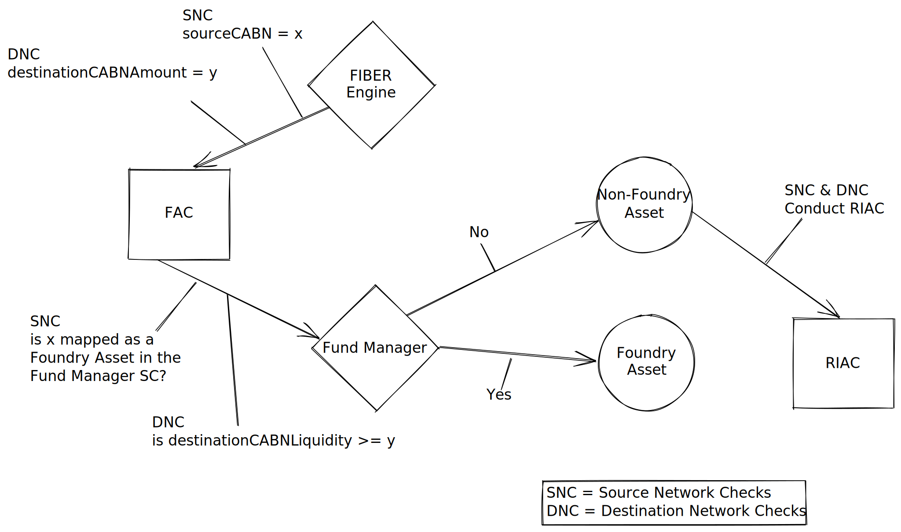

# 🔄 FIBER Router

FIBER Router is the single point of contact with the MultiSwap [Fund Manager](fund-manager.md) and is responsible for the movement of assets from user wallets to Dex Routers and/or to the Fund Manager and vice versa.&#x20;

Thanks to the FIBER Router, no wallet or smart contract directly interacts with the [Fund Manager](fund-manager.md) providing additional layers of separation for any attack vectors targeting the liquidity stored in the [Fund Manager](fund-manager.md).

### Requests from FIBER Engine

The FIBER Router receives requests from the [FIBER Engine](fiber-engine.md) and processes them according to the requirements of each given request. These can include swaps for [Foundry Assets](../asset-types/foundry-assets.md), [Refinery](../asset-types/refinery-assets.md) or [Ionic Assets](../asset-types/ionic-assets.md), or even liquidity-related events.

### Foundry Asset swap requests for FIBER Router

When the FIBER Router receives a [Foundry Asset](../asset-types/foundry-assets.md) swap request from the [FIBER Engine](fiber-engine.md) on the source network, it takes the requested [Foundry Asset](../asset-types/foundry-assets.md) tokens out of the user's wallet and deposits them in the [Fund Manager](fund-manager.md) while sending the Fees to the [Fee Manager](fee-manager.md) if this is a fee-enabled transaction.&#x20;

On the destination network, when the FIBER Router receives a [Foundry Asset](../asset-types/foundry-assets.md) withdrawAndDeposit request from the [FIBER Engine](fiber-engine.md), it takes the requested [Foundry Asset](../asset-types/foundry-assets.md) tokens from the [Fund Manager](fund-manager.md) and deposits them in the destination wallet provided in the request.

### Refinery Asset or Ionic Asset swap requests for FIBER Router

When the FIBER Router receives a [Refinery Asset](../asset-types/refinery-assets.md) or [Ionic Asset](../asset-types/ionic-assets.md) swap request from the [FIBER Engine](fiber-engine.md) on the source network, it takes the requested [Refinery Asset](../asset-types/refinery-assets.md) or [Ionic Asset](../asset-types/ionic-assets.md) tokens out of the user's wallet, moves them to the FIBER Router, then initiates the relevant DEX or Aggregator swap of this [Refinery Asset](../asset-types/refinery-assets.md) or [Ionic Asset](../asset-types/ionic-assets.md) to a [Foundry Asset](../asset-types/foundry-assets.md). Once the swap is completed, the DEX or Aggregator router deposits the [Foundry Asset](../asset-types/foundry-assets.md) into the FIBER Router. The router then deposits these tokens into the [Fund Manager](fund-manager.md) while sending the Fees to the [Fee Manager](fee-manager.md) if this is a fee-enabled transaction.&#x20;

On the destination network, when the FIBER Router receives a [Refinery Asset](../asset-types/refinery-assets.md) or [Ionic Asset](../asset-types/ionic-assets.md) withdrawSwapAndDeposit request from the [FIBER Engine](fiber-engine.md), it takes the requested [Foundry Asset](../asset-types/foundry-assets.md) tokens from the [Fund Manager](fund-manager.md), deposits them in the FIBER Router, then initiates the relevant DEX or Aggregator swap of this [Foundry Asset](../asset-types/foundry-assets.md) to the requested [Refinery Asset](../asset-types/refinery-assets.md) or [Ionic Asset](../asset-types/ionic-assets.md). Once the swap is completed, the DEX or Aggregator router deposits the [Refinery Asset](../asset-types/refinery-assets.md) or [Ionic Asset](../asset-types/ionic-assets.md) into the FIBER Router. The router then deposits these tokens into the provided destination wallet.

## The flow of a MultiChain swap

Any MultiChain swap begins with a [`multiChainSwap`](overview-fiber.md#typical-multichainswap-request-sent-to-fiber-engine) call to the [FIBER Engine](fiber-engine.md). After receiving the `multiChainSwap` request, the FIBER Engine conducts a series of checks to categorize the source and destination assets involved in the swap. The [Example of Asset Categorization](asset-categorization-and-route-optimization/example-of-asset-categorization.md) section covers these checks in detail.


[example-of-asset-categorization.md](asset-categorization-and-route-optimization/example-of-asset-categorization.md)


### Example swap scenarios

After the assets on the source and destination network are properly categorized, and the optimal route for the swap has been determined by the [FIBER Engine](fiber-engine.md), it sends the request to the FIBER Router to execute the necessary transfers. We will cover those transfer scenarios in detail now.

The scenarios include

1. Foundry Asset to Foundry Asset Swap
   1. 100 USDC on Ethereum to 3,164.5569620253 FRM on BSC
2. Foundry Asset to Refinery Asset Swap
   1. 100 USDC on Ethereum to 0.345793423 BNB on BSC
3. Foundry Asset to Ionic Asset Swap
   1. 100 USDC on Ethereum to 20.5912 XVS on BSC
4.

### Foundry Asset to Foundry Asset swap request

Example: 100 USDC on Ethereum to be swapped for FRM on BSC

First, let's go over how these were categorized.

The source and destination assets have been categorized as [Foundry Assets](../asset-types/foundry-assets.md) by the [FIBER Engine](fiber-engine.md), as demonstrated in the flow above. The FIBER Engine will now send a command to the [FIBER Router](fiber-router.md) to transfer the funds in accordance with the following optimal path.

