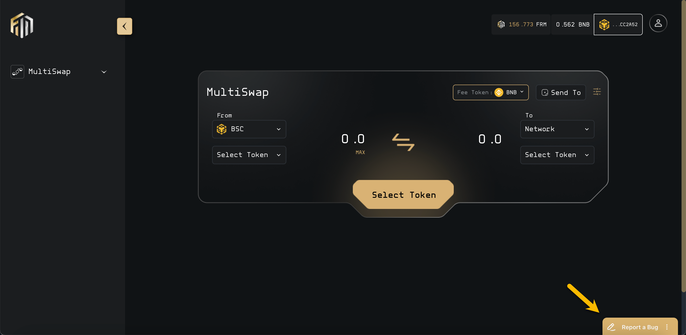

# ❔ MultiSwap - FAQs

## What is Mulitswap?

MultiSwap is a smart routing multichain DEX aggregator that enables cross-chain swaps.

Seamlessly swap _**any asset**_ on **any network** for _**any asset**_ on _**any network**_ with MultiSwap!

## How to Swap between EVM chains?

Select any EVM Network as _**FROM**_ and _**To,**_ and then select a token for swap. You will see the quotation after selecting tokens, and then you will be able to click on the Swap button.&#x20;

Users can also swap to any wallet address by entering the address in the _**Send To**_ field. \
\
Please refer to the following screencast


How to Swap between EVM chains


## How to swap between EVM and NON EVM or NON EVM and EVM chains?

You can swap by selecting EVM/Non-EVM as a _**From**_ and selecting EVM/NON EVM as a _**To**_ address. The user needs to provide an address in the _**Send To**_ field to conduct a swap.&#x20;

## Which networks are supported in MultiSwap?

Following EVM networks are supported in MultiSwap\
BSC\
Arbitrum\
Fantom \
Polygon

The following NON EVM network is supported in MultiSwap:\
Cudos[^1]&#x20;

## Which Wallets are supported in MultipSwap?

The following wallets are supported in MultiSwap\
Metamask for EVM chains and Kepler wallet for non-evm chains i.e. Cudos&#x20;

## How to get support and report bugs?

You can report bugs through the "Report a Bug" button shown on the MultiSwap dApp as shown in the picture below:

<figure><figcaption>
Repot a Bug
</figcaption></figure>

Once you report a bug, grab the bug ID then follow the instructions below to submit a support ticket to notify a member of our team through our ticketing system. We have launched a ticketing system to ensure we can get you the best support from relevant team members.&#x20;

### Submitting a Ticket in Discord

Our support system is in Discord.

**If you are already in our Discord Server**

1. Go to the `#mod-support` channel
2. Click create a ticket and submit your bug ID along with a description of the issue

**If you have not joined our Discord Server yet**

1. Join our Discord by clicking this link: \
   [https://discord.gg/TfrWeN8Vtq](https://discord.gg/TfrWeN8Vtq)
2. Accept the rules, and grab the community-member role if you haven't already done so
3. Go to the `#mod-support` channel
4. Click create a ticket and submit your bug ID along with a description of the issue

A team member will respond to your query as soon as they review the ticket request.

## What minimum amount is allowed on MultiSwap for swap?&#x20;

The minimum amount for any swap is set as `0.01`

## How to check the status of your previous swap or previous swap history?

You can check the status of your previous swaps by going to the _**My Trades**_ section from the left menu under MultiSwap. You can see the statuses of your previous swaps, which will be marked as Completed.

## What is the functionality of the switch network?&#x20;

If you are connected with a different network, and you selected a different network as From network then it will show you Switch Network. After clicking the Switch Network button you will be shifted to the required network in MetaMask.

## How to search for available tokens?

You can search for available tokens by typing in the token name or pasting the token contract address in the search token field.

## Which wallet extensions should be installed on your system for making a swap?&#x20;

MetaMask and Kepler wallet extensions are required for making swaps between EVM to NON EVM; however, only Metamask is sufficient if you are going to swap between EVM to EVM chains.&#x20;

## How do multi-chain swaps work?

Multi-chain swaps work through various processes based on the Asset's category, described as Foundry, Ionic, and Refinery assets. Please refer to the following link for more details.\
\

[^1]: 
